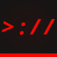

<div align="center">

<!-- Logo -->


<h1>Re://DOWN</h1>

<p>A powerful, privacy-respecting download tool.<br>Simple by default. Powerful when you need it.</p>

[](LICENSE)
[](https://github.com/yt-dlp/yt-dlp)
[](https://fastify.dev)

</div>

---

## What is Re://DOWN?

Re://DOWN is an open-source, self-hostable download tool built on top of yt-dlp. Its philosophy mirrors KDE Plasma's approach to software: clean and straightforward out of the box, deeply customizable for those who want more.

No trackers. No third-party cookies. No ads. It just works.

---

## Features

**Core**
- Supports MP3, FLAC, Opus, MP4, MKV, VP9, AV1
- Subtitle and metadata embedding (optional)
- Parallel downloads
- Quick download mode — paste URL, download instantly with active preset
- Keyboard shortcuts
- Duplicate URL warning within the same session

**Customization**
- Download presets with `downpreset.json` import/export
- Per-preset: format, resolution, output directory, thumbnail, metadata, subtitles, SponsorBlock behavior
- Theme system: light/dark mode, accent color, font, border radius, scaling, background, blur, animations, compact mode
- Custom `style.css` override + multiple built-in themes

**Privacy & Config**
- `config.json` import/export
- Optional history with CSV/JSON export
- Optional anonymous error reporting (you see exactly what's sent before it goes)

**Advanced**
- Raw yt-dlp flags
- Bandwidth limiting
- Proxy support
- Log level control
- Scheduler / auto-download
- Self-host: port & network configuration

---

## Getting Started

### Requirements

- Node.js 20+
- yt-dlp
- ffmpeg

### Install

```bash
git clone https://github.com/yourusername/redown.git
cd redown
npm install
node backend/index.js
```

Then open `http://localhost:3000` in your browser.

### Docker

```bash
docker compose up
```

---

## Configuration

Copy the example config and edit to your liking:

```bash
cp config.example.json data/config.json
```

Full config reference: [`docs/config-reference.md`](docs/config-reference.md)

---

## License

Re://DOWN is free software, licensed under the [GNU Affero General Public License v3.0 or later](LICENSE).

---

<div align="center">
<sub>Built with yt-dlp · No trackers · No ads · Forever free</sub>
</div>
